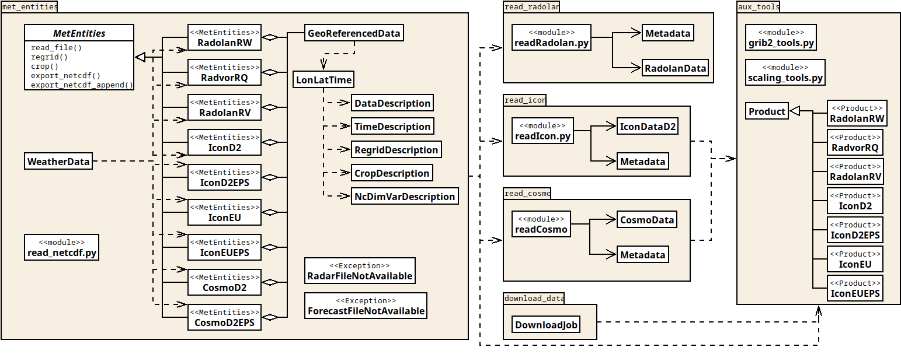

# weatherDataHarmonizer

This project facilitates the harmonizing of different weather data of the
German weatherservice (DWD). It incorporates recent data as well as forecast
data from RadolanRW, RadvorRQ, RadolanRV, Icon-D2, Icon-D2-EPS, Icon-EU, and Icon-EU-EPS products.

## Content and Usage

The weatherDataHarmonizer ist parted into different packages (e.g. `met_entities`,
`read_radolan`, `read_icon`), which can be imported into own projects. Various
example implementations are given in `eval_met_packages.py`.

The next import lines provide access to all advanced reading and harmonizing
features. Low-level access to single modules in `read_radolan` or `read_icon`
packages is also possible and can serve for own projects.

### Example 1: read/export one raw dataset

This code example defines a target grid, reads in one time step of RadolanRW data,
regrids the data using IDW method with the nearest three neighbors, and exports the
resulting grid to a netcdf file.

```python
import datetime as dt
import numpy as np
from met_entities.RadolanRW import RadolanRW
from met_entities.LonLatTime import LonLatTime

# define target grid
lon = np.arange(4, 15, .3)
lat = np.arange(54, 48, -.3)
lon_target, lat_target = np.meshgrid(lon, lat)
lon_target = LonLatTime(data=lon_target)
lat_target = LonLatTime(data=lat_target)

# read, regrid, and export data
start_datetime = dt.datetime(2022, 10, 25, 6, 50)
radrw = RadolanRW()
radrw.read_file(start_datetime=start_datetime, directory='path/to/data')
radrw.regrid(lon_target=lon_target, lat_target=lat_target)
radrw.export_netcdf('path/to/netcdf.nc')
```

### Example 2: read/export multiple raw datasets

The next example shows the collection of data from multiple time steps. Here, only IconD2 data is read and 
exported/appended to a netcdf file. At the first time step the netcdf file is created. All other steps will append data
to this file along the time dimension. The data is packed via `data_format='i2'` and `scale_factor_nc=0.01` (explanation 
see below in example 3)

```python
import datetime as dt
import numpy as np
from met_entities.LonLatTime import LonLatTime
from met_entities.IconD2 import IconD2

# define target grid
lon = np.arange(4, 15, .3)
lat = np.arange(54, 48, -.3)
lon_target, lat_target = np.meshgrid(lon, lat)
lon_target = LonLatTime(data=lon_target)
lat_target = LonLatTime(data=lat_target)

# define forecast time steps to be read in
start_datetime = dt.datetime(2022, 12, 14, 9)
end_datetime = dt.datetime(2022, 12, 14, 15)
period_step = dt.timedelta(hours=3)
periods = [start_datetime]
ct = 0
while periods[-1] < end_datetime:
    ct = ct + 1
    periods.append(start_datetime + ct * period_step)
    
# read, regrid, and export/append data
nc_file = 'path/to/netcdf.nc'
mode = 'create'
for period in periods:
    print(period)
    icond2 = IconD2()
    icond2.read_file(period, directory='path/to/data', forecast_hours=2, fill_value=-1)
    icond2.regrid(lon_target=lon_target, lat_target=lat_target, file_nearest='path/to/regridding/rule.npz')
    if mode == 'create':
        icond2.export_netcdf(nc_file, data_format='i2', scale_factor_nc=0.01)
    else:
        icond2.export_netcdf_append(nc_file)
    mode = 'append'
```

### Example 3: read/harmonize/export multiple datasets of different types

The class WeatherData is developed for the harmonizing of different data resources (the same temporal and spatial 
resolution, the same scaling and the same filling of missing values). For instance, we start with measured RadolanRW 
data from 2 hours ago until the most recent time step, include IconD2 forecast data and afterwards replace the nearest 
forecast by nowcast products like RadolanRV. The latter two products are assumed to be stored in monthly separated 
directories (e.g. .../icond2/202302/...). All summarized data shall be exported as a netcdf file with a filename 
reflecting the actual datetime. The following code shows this example.

```python
import numpy as np
import datetime as dt

from met_entities.VariableDescription import RegridDescription
from met_entities.LonLatTime import LonLatTime
from met_entities.WeatherData import WeatherData

def main_combined_data():
  # define an arbitrary target grid
  lon = np.arange(4, 15, .3)
  lat = np.arange(54, 48, -.3)
  lon_target, lat_target = np.meshgrid(lon, lat)
  lon_target = LonLatTime(data=lon_target)
  lat_target = LonLatTime(data=lat_target)

  # define the time of the supposed last observation
  time_now = dt.datetime.now(tz=dt.timezone.utc)
  time_pivot = dt.datetime(time_now.year, time_now.month, time_now.day, time_now.hour, tzinfo=dt.timezone.utc)
  
  # define regridding descriptions for all used products
  regrid_description = {'radolanrw': RegridDescription(lon_target=lon_target, lat_target=lat_target,
                                                       file_nearest='data/radrw_regridding.npz'),
                        'radolanrv': RegridDescription(lon_target=lon_target, lat_target=lat_target,
                                                      file_nearest='data/radrv_regridding.npz'),
                        'icond2': RegridDescription(lon_target=lon_target, lat_target=lat_target,
                                                    file_nearest='data/icond2_regridding.npz')}
  
  # instantiate WeatherData class with central specifications (temporal/spatial resolution, filling, scaling, usage of 
  # np.int16 type for memory saving)
  wd = WeatherData(time_now=time_pivot, delta_t=dt.timedelta(minutes=15), fill_value=-1, scale_factor=0.01,
                   regrid_description=regrid_description, short='int16')

  # collect all data, RadolanRW starting two hours ago
  wd.collect_radolanrw(time_start=time_pivot - dt.timedelta(hours=2), directory='path/to/radolanrw')
  wd.collect_icond2(latest_event=time_now, directory='path/to/icond2', dir_time_descriptor=['%Y%m'])
  wd.collect_radolanrv(latest_event=time_now, directory='/mnt/08_hwstore/RadolanRV', dir_time_descriptor=['%Y%m'])

  # export to netcdf with packed data (type i2: short integer, internal netcdf scaling of 0.01, undo the scaling from 
  # above); the large data variables are compressed with zlib and compression level 4
  filename_nc = f'data/precipitation_data_example_{wd.time_now.strftime("%Y%m%d%H%M")}.nc'
  wd.export_netcdf(filename=filename_nc, institution='Institution as global attribute', data_format='i2', 
                   scale_factor_nc=0.01, scale_undo=True, data_kwargs={'compression': 'zlib', 'complevel': 4})
```

Please note the `scale_factor=0.01` in the WeatherData instance in combination with `short='int16'`. This combination 
guarantees a precision of two floating points with a possible maximum of 327 (reasonable for 15 min precipitation). The
data could be left in original float precision (simply omit `scale_factor` and `short`) if memory consumption is not 
limiting. The possibility of `short` is specifically included for IconD2EPS data that consumes a lot more memory if used 
for the whole prediction region and time.

Please also note the exporting to netcdf method with `data_format='i2'`, `scale_factor_nc=0.01`, and `scale_undo=True`.
This combination takes back the scaling from data import and defines an internal scaling for netcdf and short integer 
type for the data. The resulting netcdf file will be much smaller but ensures the same precision of two floating points.
This method is known as packing data values. All typical libraries to access netcdf content consider the `scale_factor`
variable attribute and de-pack the data automatically. The accompanying `add_offset` attribute for packing is not 
supported here as the data is typically extended over time and a perfect packing (recommendations here: 
https://docs.unidata.ucar.edu/nug/current/best_practices.html) cannot be done. Moreover, it would introduce more 
complexity with missing values.

Further the data variable is compressed to save storage.

### Structure



A detailed UML class diagram including variables and methods can be found in `weatherDataHarmonizer_UML.png`.

### met\_entities

The package `met_entities` consists of different classes to handle different
weather data formats of the german weather service (DWD). It supports
RadolanRW, RadvorRQ, RadolanRV, IconD2, IconD2EPS, IconEU, IconEUEPS, CosmoD2, CosmoD2EPS datasets.

*Modules*

- `MetEntities.py`: contains MetEntities class as an abstract class that defines methods for
  handling meteorological data
- `RadolanRW.py`: contains RadolanRW class that provides all relevant data and methods of
  RadolanRW data from DWD
- `RadvorRQ.py`: dito for RadvorRQ data
- `RadolanRV.py`: dito for RadolanRV data
- `IconD2.py`: dito for Icon-D2 data
- `IconD2EPS.py`: dito for Icon-D2-EPS data
- `IconEU.py`: dito for Icon-EU data
- `IconEUEPS.py`: dito for Icon-EU-EPS data
- `CosmoD2.py`: dito for Cosmo-D2 data
- `CosmoD2EPS.py`: dito for Cosmo-D2-EPS data
- `GeoReferencedData.py`: contains GeoReferencedData class that serves as a
  container for spatial data including coordinates, data and their description;
  further elementary methods are implemented (regridding, cropping)
- `LonLatTime.py`: contains LonLatTime class that is used as a container for
  coordinate- or time-related data to facilitate the export to netCDF
- `VariableDescription.py`: contains classes DataDescription (further
  description of climate data), TimeDescription (description of time aspects
  of climate data), RegridDescription (attributes necessary for regridding),
  CropDescription (attribute necessary for cropping), and NcDimVarDescription
  (name convention for netcdf dimensions and variables)
- `Exceptions.py`: contains typical exceptions raised in met_entities
- `WeatherData.py`: contains WeatherData class that provides collection and
  harmonizing routines for all types of above-mentioned supported data

### read\_radolan

The `read_radolan` package provides access to radolan formatted data from the german weatherservice (DWD).

*Modules*

- `readRadolan.py`: includes reading compressed and uncompressed DWD binaries.
  Further it provides a function to get the coordinates (lon/lat) of sphere
  earth model (older version) and the newer WGS84 ellipsoid earth model.
- `Metadata.py`: contains Metadata class with relevant metadata of radolan
  formatted data.
- `RadolanData.py`: contains RadolanData class with relevant data of radolan
  formatted data.

### read\_icon

The `read_icon` package provides access to Icon formatted data from the german weather service (DWD).

*Modules*

- `readIcon.py`: provides a function to read in typical Icon data, either as
  bz2 compressed or uncompressed grib data. In the case of compressed data a
  temporary file is written (in OS specific temporary folder) and deleted
  afterwards. Further a function is incorporated to return coordinates
  (lon/lat). Third, a function is included to return the keys and values of a specific grib message.
- `Metadata.py`: contains Metadata class with relevant metadata of Icon
  formatted data.
- `IconData.py` contains IconData class with relevant data of Icon formatted
  data.

### read\_cosmo

The `read_cosmo` package provides access to Cosmo formatted data from the german weather service (DWD). Cosmo support is
for hind-cast purposes only since the DWD does not deploy Cosmo model results anymore.

*Modules*

- `readCosmo.py`: provides a function to read in typical Cosmo data, either as
  bz2 compressed or uncompressed grib data. In the case of compressed data a
  temporary file is written (in OS specific temporary folder) and deleted
  afterwards. Further a function is incorporated to return coordinates
  (lon/lat). Third, a function is included to return the keys and values of a specific grib message.
- `Metadata.py`: contains Metadata class with relevant metadata of Cosmo
  formatted data.
- `CosmoData.py` contains CosmoData class with relevant data of Cosmo formatted
  data.

### download\_data

The `download_data` package contains download helpers for specific data from DWD.

*Modules*

- `DownloadJob.py`: provides methods for downloading files and deleting them (after usage).

### aux\_tools

The `aux_tools` package incorporates auxiliary functions for several other modules.

*Modules*

- `Product.py`: contains Product class with technical data for download.
- `products.py`: contains classes for all supported products (inherited from Product class) with general data, url
  and file naming conventions.
- `grib2_tools.py`: includes grib2-format specific functions, e.g. to write a temporary grib file from a compressed
  file, to get keys from a grib message, or to flatten accumulated datasets.
- `scaling_tools.py`: provides functions for the handling of missing values in netcdf and a potential netcdf data 
  packing.

### tests

This package contains the unittests and necessary resources.

## License
The weatherDataHarmonizer is licensed under Apache-2.0. You may obtain a copy
of the License here in LICENSE or at http://www.apache.org/licenses/LICENSE-2.0.

## Contact

Michael Wagner [michael.wagner@tu-dresden.de](mailto:michael.wagner@tu-dresden.de)

